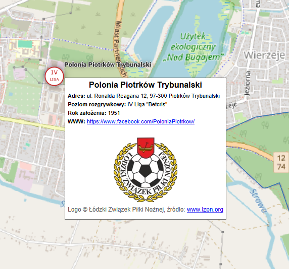
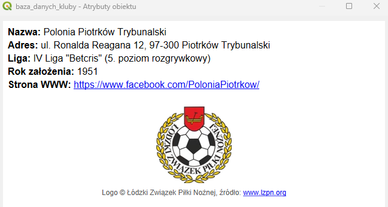

# PL: Piłkarska mapa województwa łódzkiego – od B klasy do Ekstraklasy w sezonie 2025/26
# EN: Football Map of the Łódź Voivodeship – from B Klasa to Ekstraklasa in the 2025/26 Season

**[CLICK HERE TO VIEW THE MAP](https://lukaszjecek.github.io/lodzkie-na-mapach-2025/)**

This project won 2nd place in the students and university graduates category in the "Łódzkie na mapach 2025" contest organized by the Marshal's Office of the Łódź Voivodeship. 
Author: Łukasz Jęcek

## About the Project
The main goal of this work was to gather spatial data concerning football clubs in the Łódź Voivodeship and present it in the form of an interactive web map. The database includes sports facilities categorized by league levels, facilitating the quick location of teams in the region.

This project serves as an example of using Geographic Information Systems (GIS) to solve problems related to scattered information and the categorization of sports data.

### Main Map Composition
A view covering the borders of the Łódź Voivodeship along with a custom legend classifying football leagues:

### Details and Map Fragments
For areas with a high density of facilities, appropriate zoom levels and navigation mechanisms were introduced to maintain readability:

### Clear Information (HTML Pop-ups)
Instead of standard QGIS attribute tables, modified information widgets were used. Utilizing HTML and CSS code allowed for the creation of an interface that clearly presents key information about the facility.

* View of attributes appearing upon hovering the cursor over a marker:

* View of detailed attributes displayed after clicking an object:

## Tools Used
* **QGIS:** vector data analysis, cartographic composition, and layer preparation.
* **qgis2web / Leaflet:** transformation of the desktop project into an interactive browser map format.
* **HTML / CSS:** advanced formatting of pop-up windows and implementation of responsive interface behavior.
